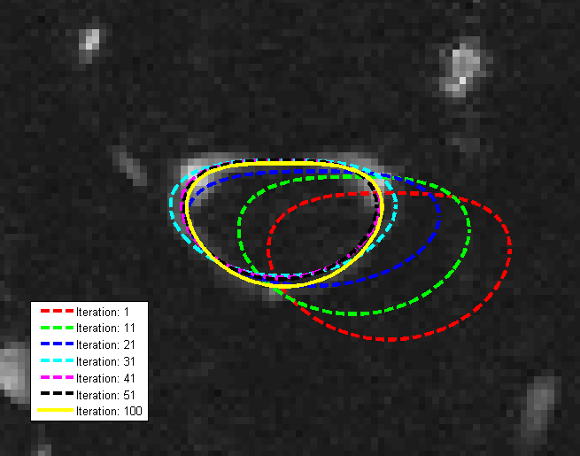

# AGSM: Active Geometric Shape Models

[](https://www.mathworks.com/matlabcentral/fileexchange/38358-active-geometric-shape-models)
[](https://github.com/wq2012/AGSM/actions/workflows/octave.yml)

## Table of Contents
1. [Overview](#overview)
2. [Installation](#installation)
3. [Usage](#usage)
4. [Unit Testing](#unit-testing)
5. [Useful Links](#useful-links)
6. [Copyright and Citation](#copyright-and-citation)
7. [Version History](#version-history)

---

## Overview

This software implements **Active Geometric Shape Models (AGSM)** for robust feature extraction and shape fitting. It supports:
- Line fitting
- Circle fitting
- Ellipse fitting
- Cubic spline fitting

AGSM leverages Gradient Vector Flow (GVF) and iterative force-based optimization to fit geometric primitives and flexible contours to image data.



## Installation

### Prerequisites
- MATLAB or GNU Octave
- C++ Compiler (for MEX file compilation)

### Compilation
Before using the library, you must compile the C++ MEX files. Run the `compile.m` script located in the `code` directory:

```matlab
cd code
compile
```

## Usage

The library includes several demo scripts to illustrate how to use the different fitting modules. You can find them in their respective directories under `code/`:

- **Line Fitting:** `code/line_fitting/demo_line_fitting.m`
- **Circle Fitting:** `code/circle_fitting/demo_circle_fitting.m`
- **Ellipse Fitting:** `code/arbitrary_ellipse_fitting/demo_ellipse_fitting.m`
- **Spline Fitting:** `code/spline_contour_fitting/demo_spline_contour_fitting.m`

### AGSM Canvas App
You can also play with the AGSM Canvas app, an interactive tool for exploring AGSM. It runs on 64-bit Windows and 64-bit macOS.

## Unit Testing

A comprehensive unit test suite is provided to ensure library robustness and correctness. To run all tests, execute the following in MATLAB or Octave:

```matlab
cd code/tests
run_tests
```

The test suite covers math utilities, force field calculations, and all fitting modules.

## Useful Links

- **Project Website:** https://sites.google.com/site/agsmwiki/
- **MathWorks File Exchange:** [Active Geometric Shape Models](https://www.mathworks.com/matlabcentral/fileexchange/38358-active-geometric-shape-models)
- **YouTube Demo:** [Watch Video](https://www.youtube.com/watch?v=c6Vto4VN5GA)

### External Tools (Related)
- **GVF Algorithm (Matlab version):** http://www.iacl.ece.jhu.edu/static/gvf/
- **s-t Graph Cuts:** http://vision.csd.uwo.ca/code/
- **DRLSE (Active Contours):** http://www.engr.uconn.edu/~cmli/DRLSE/

## Copyright and Citation

```text
Copyright (C) 2012 Quan Wang <wangq10@rpi.edu>,
Signal Analysis and Machine Perception Laboratory,
Department of Electrical, Computer, and Systems Engineering,
Rensselaer Polytechnic Institute, Troy, NY 12180, USA
```

If you use this software for academic purposes, please cite our paper:

```
Quan Wang, Kim L. Boyer,
The active geometric shape model: A new robust deformable shape model and its applications,
Computer Vision and Image Understanding, Volume 116, Issue 12, December 2012, Pages 1178-1194,
ISSN 1077-3142, 10.1016/j.cviu.2012.08.004.
```

For commercial use, please contact the authors.

---

## Version History

### Version 2.4

1. Added comprehensive unit tests and continuous integration with Octave.
2. Better documentation and code format.

### Version 2.3

1. Robustness of closed contour fitting is dramatically improved by smart initialization (see InitialCircle.cpp).
2. Line fitting is compared to Hough transform and RANSAC least squares.
3. Circle fitting is compared to circle Hough transform.

### Version 2.2

1. We made the AGSM Canvas app more robust by smart initialization and image padding.
2. Only one app for both 64-bit Windows and 64-bit Mac.

### Version 2.1

1. We added the AGSM Canvas app, which is an interactive software.

### Version 2.0

1. We added the line fitting and circle fitting packages.
2. We re-implemented GVF in C++/MEX to make it much faster.
3. We implemented Bresenham algorithm in C++/MEX to generate points on a line.
4. All force/torque computations are re-implemented in C++/MEX, which significantly improves efficiency.
